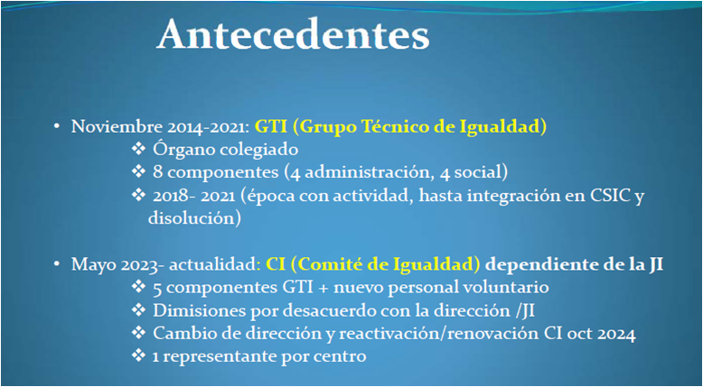
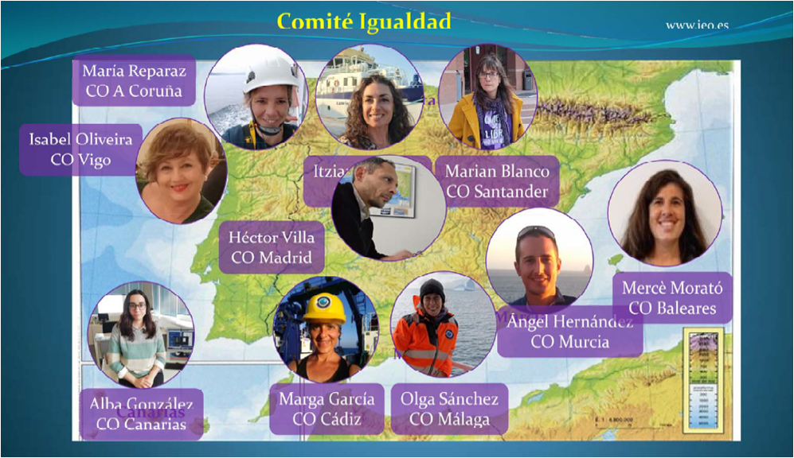
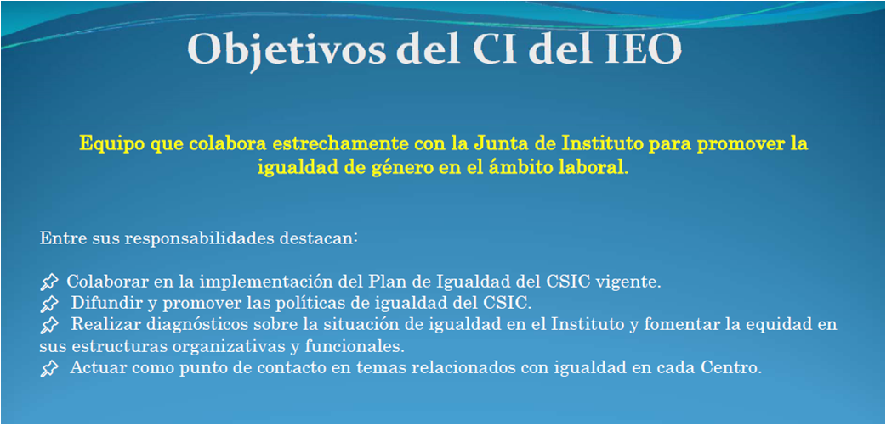

En 2024, Marian Blanco (representante del COST en el Comité de Igualdad) y Carmen Lobo (sustituta en el CI) organizan la presentación del nuevo Comité de Igualdad con motivo del 8M, donde exponen la composición (1 persona por Centro Oceanográfico, sus funciones, objetivos y los grupos de trabajo creados para avanzar en pro de la igualdad en nuestro organismo.

  
  

  
  

Los 5 grupos temáticos son: Conciliación, Igualdad de Oportunidades, Protocolo de acoso sexual o por razón de sexo, Formación y Divulgación

<https://saco.csic.es/s/HWcKQQ78Hp39M27>

Tras la presentación, se proyectaron estos cortos y hubo un debate posterior.

Mayoría oprimida (11 minutos)

<https://www.youtube.com/watch?v=XFukvZ-7lDU>

Cosas de chicos (9 minutos)

<https://www.youtube.com/watch?v=g7RXnV_DKBo>

