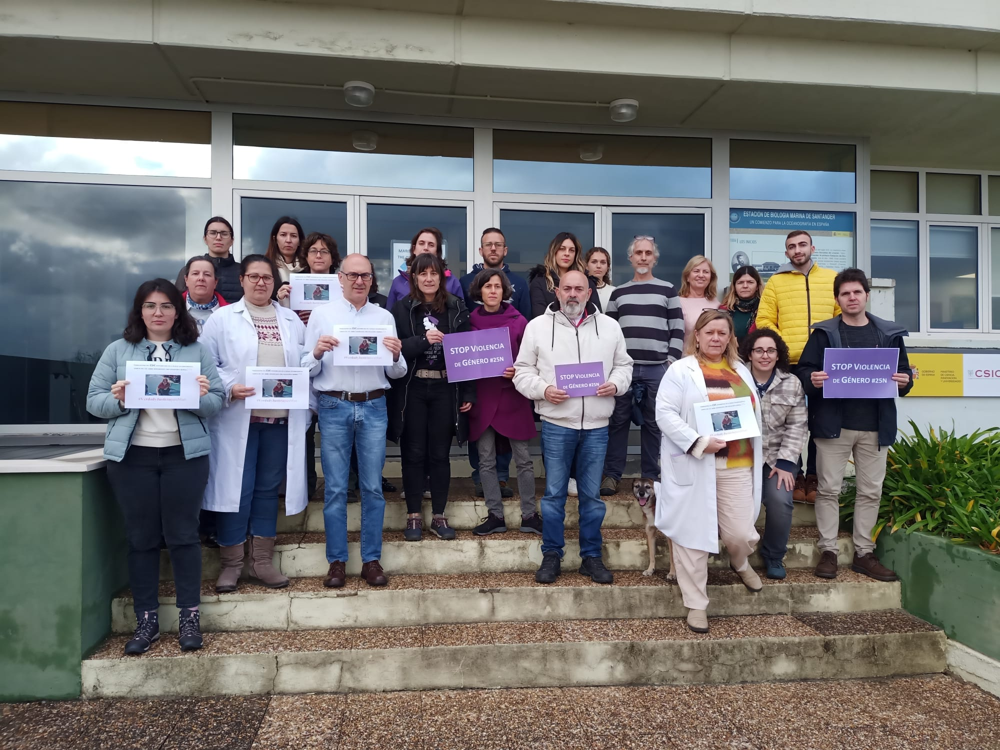
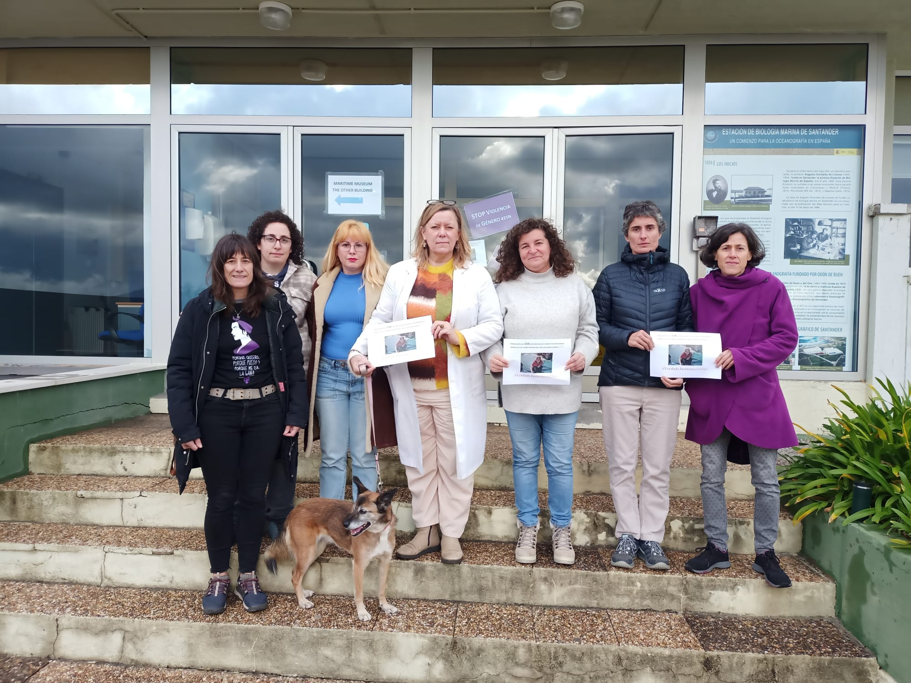
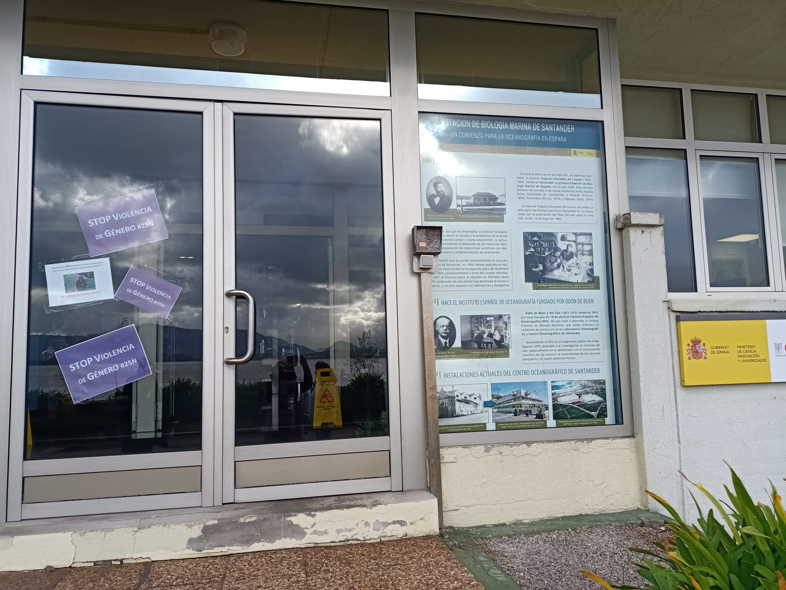

El personal del Centro Oceanográfico de Santander muestra su repulsa ante la violencia de género que suma 39 víctimas mortales dejando 20 niños y niñas huérfanas en 2025 en nuestro país. 

En nuestro entorno nuestra memoria se dirije a la dolorosa e inaceptable ausencia de  Mª del Carmen Fernández Vázquez, trabajadora del CSIC que desapareció a bordo del B/O García del Cid mientras trabajaba en septiembre de 2023, habiendo presentado denuncia por violación años antes.

  
  
  

