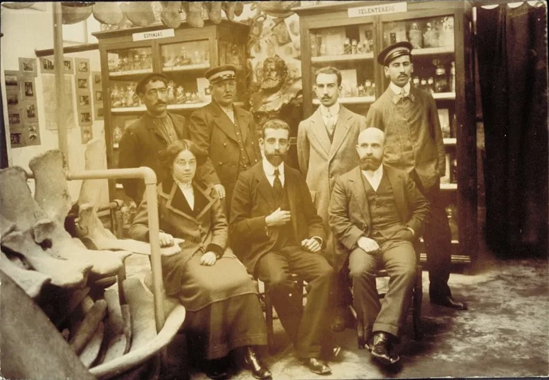
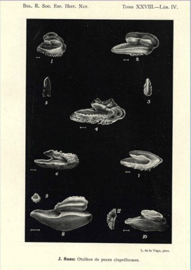

  

Nació en Guetaría en 1889.
De formación autodidacta, tuvo gran vocación por la historia natural marina. 
Se especializó en la recolección y conservación de ejemplares marinos, concretamente en el estudio anatómico y taxidermia de peces. 
Estuvo contratada en la Estación de Biología Marina de Santander durante 9 años.

  

En 1916 obtuvo otra plaza de preparadora en el Museo de Ciencias Naturales de Madrid (MNCN). Llevó a cabo estudios de los otolitos de los peces de aguas ibéricas y atlánticas del Sahara y publicó numerosos artículos científicos en revistas de la Real Sociedad Española de Historia Natural (RSEHN) y del Instituto Español de Oceanografía entre 1926 y 1949. Coincidió con otra naturalista e ilustradora, Luisa de la Vega, que fue contratada como dibujante también en el MNCN en 1923 e hizo las ilustraciones de algunos de sus artículos, creando una colaboración y encuentro entre mujeres naturalistas muy novedosa y pionera para la época.

  

Dado su reconocimiento nacional fue solicitada para hacer colaboraciones entre otras con la Sociedad de Oceanografía de Guipúzcoa.
En la última etapa de su vida estaría como Vicebibliotecaria y Bibliotecaria en la RSEHN, hasta 1952 que moriría en Madrid.
Josefa Sanz Echevarría es otro referente a sacar a la luz e incluirlo en la historia de la biología marina española, por sus aportaciones en el estudio y disección y taxidermia de peces, en una época en la que muy pocas mujeres podían acceder a la educación y los hombres eran los únicos visibles en los ámbitos científicos. Además es admirable cómo desde su formación autodidacta llegó a un reconocimiento nacional con numerosas publicaciones científicas.  

Fuentes:

- [Charla "Pioneras del Cantábrico y el mar". Museo Marítimo del Cantábrico, Santander](https://www.youtube.com/watch?v=lomMfRnqq7E)

- [Proyecto Oceanicas, IEO, CSIC](https://oceanicas.ieo.es/luisa-de-la-vega-1862-1944-pionera-ilustradora-de-los-animales-marinos/)

- https://theconversation.com/mujeres-pioneras-ilustradoras-cientificas-rescatadas-del-olvido-190761

